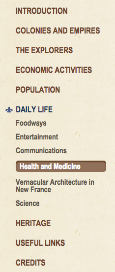

### Review of the Virtual Museum of New France
#### 13 April 2017

[The Virtual Museum of New France/Musée Virtuel de la Nouvelle-France](http://www.historymuseum.ca/virtual-museum-of-new-france/)

For my final review, I’ve decided to take a closer look at a site I’ve been exploring for quite some time now. Part of my research interests bring me into the Early Modern period and across the Atlantic to the French colonies in North America. In my search, I came across the Virtual Museum of New France (VMNF), which, as the name indicates, is a wonderful multimedia resource for learning about French-speaking North America in its infancy.

**Overview**

The first facet of the website I want to address is what I said in my intro, when I noted that the website is a “wonderful multimedia resource.” The site is a virtual museum insofar as it provides maps, paintings, drawings, photos of furniture, and abundant information regarding the conditions behind the colonization and inhabitation of New France. All of these different media allow for a similar museum experience that differs from other internet archives. Additionally, each section (“Colonies and Empires;” “The Explorers;” “Economic Activities;” “Population;” Daily Life;” “Heritage”) and subsection has a section for suggested readings. This built-in bibliography is really helpful for people like me who, in particular, are interested in broadening their research topic, even if it is tangentially related to what the VMNF displays. That said, this site is intended for those who want to learn more about New France and it is an assemblage of scholarly thought: it’s pretty solid public scholarship. The site is, naturally, available in French/disponible en français, as well.

But, enough about generalizations. Here are some criteria by which I’ve decided to evaluate VMNF

**Visual Aesthetics**

I’ll say this: the VMNF website looks professional, organized, and user friendly. To access the homepage, a visitor must click on the “Enter the Virtual Museum” button, and they are led to the main page:

At the main page, there is a “Did you know?” window on the right side which displays a different fact every time the page is reloaded or visited:

There are two headers, one for the Canadian Museum of History:

And a more artistic header for the virtual museum. An 18th-century painting is edited so it’s ragged at the bottom and “bleeds” nicely into the body of the website:

The nav bar is located on the left-hand side and each section expands and collapses to reveal subsections, and a current, highlighted link will display a fleur de lys next to which—it fits the theme and it looks nice:

 Finally, the photos, drawings, and maps all look nice and are able to be clicked, which displays the image in a floating window which looks similar to an information placard that would be displayed in a museum:

 

The color scheme is neutral and earth tones, which lends a vague historical, colonial feels to the site. My biggest critique is the font used for the nav bar and headings of each page (“Arial Narrow,” sans-serif) : it is really narrow and really close together, which makes reading slightly labored. Similarly, the font size for the body of the website is fairly small (“Helvetica,” 1.1em), which may cause some problems when combined with the low-contrast background. Normally Helvetica is great, but the size here is not. My colleague [Sarah]( https://spswanz.github.io/) has opened my eyes to the font-size problem, and I know that she would probably *hate* this site for that reason alone.

Finally, the footer is simple and contains icon links to the museum’s Facebook, Twitter, and Instagram accounts (all of which work).

The footer also contains privacy and copyright statements, so they’ve got all their bases covered. I think the difference between the “historical” body of the site and the “modern” header and footer works seamlessly.

**Collaboration**

As far as collaboration goes, this site is at the top of its class. Every section, and often ever subsection, is authored by a different scholar or authority from Canada, the US, and Europe. The VMNF is really great at giving credit where it is due, and the site has a section for credits, which lists the names of all those involved, including museum’s core team and the web development team. To what extent the scholars worked with one another is unknown to me, but it’s clear that the information on the site comes from many different people across the world.

**Interactivity**

As I mentioned above, the media on the site are interactive, in so far as one can click on an image to explore it further. Another interactive aspect of the VMNF is found in “The Explorers” section: maps. By clicking on an explorer’s name, a visitor can read biographical information and view the various routes the traveler either took or reportedly took. The maps are animated and visualize the chronological and spatial progression of the explorers. At any point a visitor can click the “reset” button to start the visualization over from the beginning. Here’s a map for the routes of Médard Chouart des Grosseilliers:

In this image, the visualization is over and the routes are visible. The key is very clear, but after the visualization is over, the arrows on the routes disappear, so there is no indication of the direction of travel. This is the biggest pitfall of the maps: I have to watch the visualization over again in its entirety. A little more control of the animation is desirable, although I don’t believe a map like this needs to be wholly interactive, or more complex. Here, simplicity is key.

**Data**

The VMNF’s weakest point is its data, particularly for the maps. Of course credit is given to various scholars, but I want to know how the maps were made (for selfish reasons because I want to borrow their layout). Where did they get the points from? What programs did they use to create the maps and the subsequent visualizations? I tried to find out through inspecting the map on my browser, but I was ultimately unsuccessful.

  

Another moment where data (explained data, at least) would have been useful is in discussions of trade networks and economics. Discussion of networks is one thing, but I would have loved to have seen some tables and even some visualizations of this type of data. Similarly, in talking about population size and immigration, it’s really hard to follow along by just reading the numbers in a paragraph form. The site mentions the sources of its information (yes! great!), but doesn’t use it wisely. It’s here that the website doesn’t take advantage of its virtuality and the possibility for more interactivity than maps and a more fruitful cross-disciplinary approach.

  
(Discussion of sources is good, but doesn't quite pull its weight.)

**Conclusion**

Overall, I’d rate this site an 8.8/10. The VMNF is informative, collaborative, and engaging, as a museum ought to be, but it doesn’t quite cut it with the lack of medium-specific interactivity.
