### Here There Be (More) Maps!
#### 25 April 2017

After all that talking I did about maps, I went ahead an made my own. Recently, I've been into one of the more recent installments of the *Assassin's Creed* franchise, *Rogue*, and this one is set in North America during the Seven Years' War (also known, politically incorrectly and historically inaccurately, The French and Indian War) so, the mid-18th century.

My personal interest in this game comes from having grown up in Albany, NY, which is one of the locations you can explore in the game. As I moved through the game, I became increasingly interested in how the maps aligned with real-world maps. Since a lot of games I've played operate on game-world maps that aren't based on reality, I was excited to see maps that resembled reality.

In the game, you can travel through three regions of North America:
1.) The North Atlantic
2.) The Hudson River Valley
3.) New York (City)

In effect, there are 4 maps you interact with in the game menu: the map of North America and maps of each of the regions:

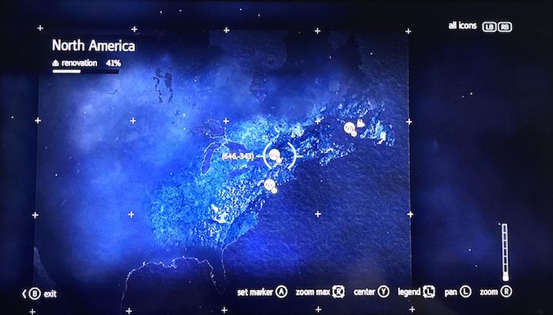  
(I apologize for the quality of these photos, Xbox 360 does not have the capability to take a screenshot)
The map of North America is absolutely recognizable, with New France and the British colonies (and Spanish Florida in the south) exposed and the rest of the unexplored-—by Westerners, of course--land is covered by the every popular mist (see Age of Empires, etc.)

While playing, I came to realize that the most unrealistic map in the game was by far the Hudson River Valley map. Already on the larger map, I noticed that the River Valley region was not where it should be; it looks to be right on Lake Erie as opposed to much farther east. When zooming in to the region, once can see that it's not a river valley so much as an unnavigable set of islands and waterways:

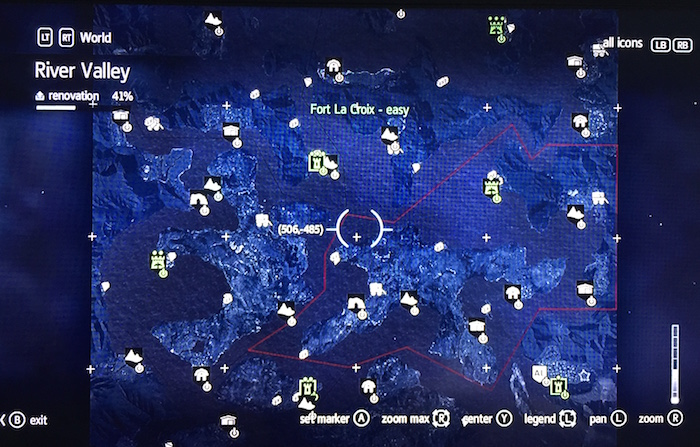

The reasoning behind this design is, of course, to make gameplay more interesting. Your main character, Shay Cormack, must also learn how to sail through the world in addition to exploring by foot. In fact, each region from North to South decreases in the required use of your ship, with the North Atlantic requiring the most and New York City requiring the least. Your ship, The Morrigan, as seen ramming through ice in the North Atlantic:

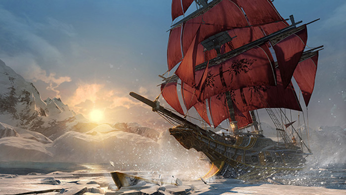

Back to the River Valley. In reality, the Hudson River runs 315 miles, North to South from the Adirondack Mountains to the Atlantic Ocean. During the Seven Years' War, it was probably *the* most important inland waterway because it connected New York City and Montréal. In reality, it does not look anything like the map above. Additionally, there are so many place names within the map that do not exist (nor that I could find in my research). The Sub-regions and settlements of the River Valley are:

**Albany**  
Sleepy Hollow and Albany  
**Two Bends**  
Ash Creek, Red Bank, and Mt. Vernon  
**Fort Soleil**  
Otetiani, Orenda, Ruisseau de Renard  
**Fort La Croix**  
Mont St. Denis, Vallée Verte, Marai Rocheaux  
**Fort Blanc**    
Dekanawide, Lock Cliff, Two Snake Path,  
Aarushi, Vieille Carriere, Coeur de l'Hiver,
Rivière Aurifere, Le Bras-du-Seigneur, and Or-du-Nord
**Lac Eternel**    
Fleur le Vent, Île de Pins, and Genessee

The names are a mixture of French and English, which indicates the land struggle between the French and the British at the time, and there are also Native American settlements (Genessee, Dekanawide, Orenda, Otetiani, and Aarushi) found in the area, of which I could find no reference or record outside of the game. Actually, the only place names that I knew or found to exists are: Albany, Mt. Vernon, and Sleepy Hollow.

I decided, then, to take a closer look at the Albany region, since it's home:

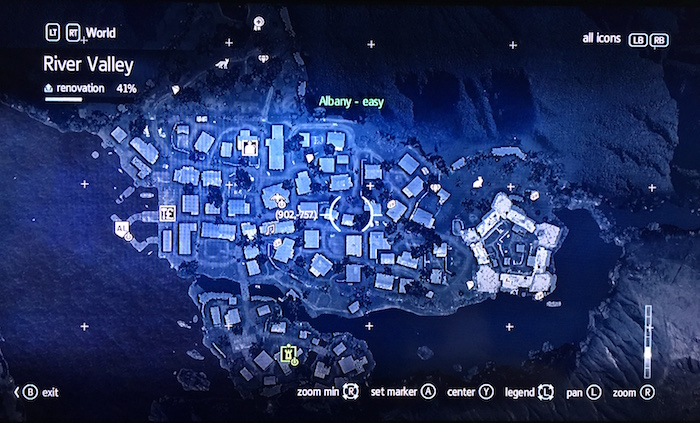

Upon closer inspection, I realized that I could not make geographic sense of what I was seeing. For starters, Albany is on the western bank of a N-S river. So, I thought the map was oriented with the top of the map SSW or WSW. Then I noticed what looks like Fort Ticonderoga, which is north of Albany, neither in nor west of it:

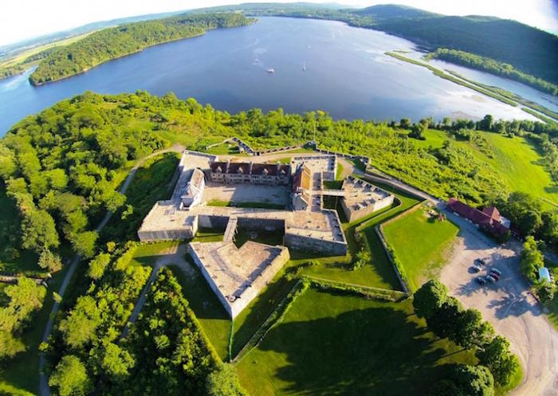

In fact, Fort Ticonderoga is nearly 100 miles north of Albany on the southern end of Lake Champlain, which makes its placement so close to Albany in the Another alternative fort is Fort William Henry, but it, too, is 60 miles north of Albany. So, I realized that there could be another possibility, and that is that there was a fort in Albany, which used to be Fort Orange! Of course! I found a map of Albany as it looked in 1695 and lo and behold, there's an actual fort there. At the time of the Seven Years' War, however, it was known as Fort Frederick, and it was during this time it held the largest contingent of British soldiers:

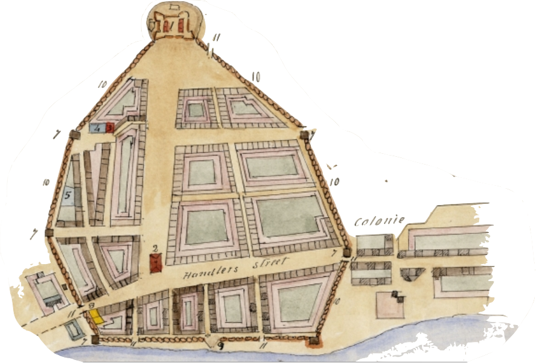

What I learned from this, then, is that while the overall map of the River Valley Region was messy, the map of Albany was very well researched by the design team at Ubisoft

Here's an example from [Mapwarper](mapwarper.net) in which someone actually took the map of 17th-century Albany and did an overlay with the modern city:

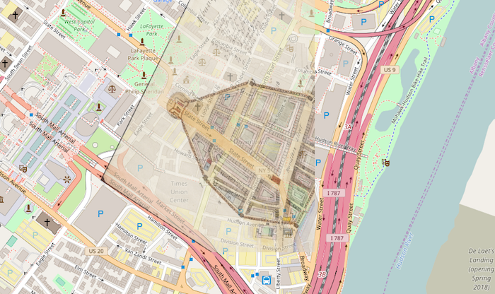  
They took my plan! But, it looks really good.

**The Next Step**  
I decided to make my own map so that I could explore the North American theatre of the game as a whole and also demonstrate how the "real" places in the River Valley would look on a map and not in the game.

Since a data set is required to geo-plot points on a map, I went to Google Maps and located all of the places I wanted to include. I copied all of the coordinates and put them into a spreadsheet, which I then downloaded as a CSV file:

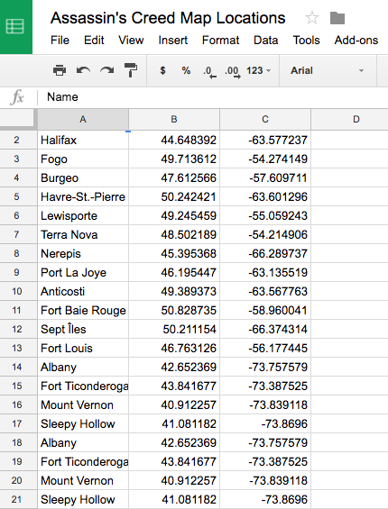

Once I had my spreadsheet made, I decided that I was going to use [Mapbox](https://www.mapbox.com/) to host my map because it's fairly minimalist, and I found it easy to use. So, I chose my theme and I uploaded my CSV file and Mapbox plotted my points. After all of my points were georeferenced, I decided to draw outlines around each of the regions in order to show, on the big map, where they are in relation to one another.

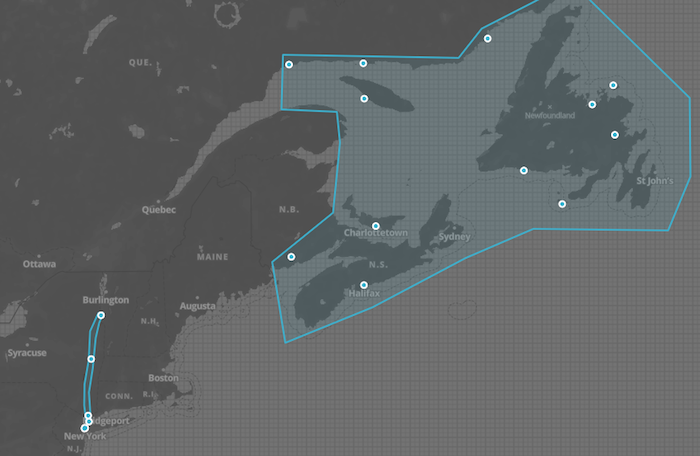

The most noticeable characteristic of my map that is missing from the game's map is that my Hudson River Valley region is a lot farther east and it runs the length of the Hudson River, which makes it really long and thin. Zooming in on the southern end of the River Valley, I can see the New York region and how close they are to one another, which is something a player can't surmise from the game's maps.

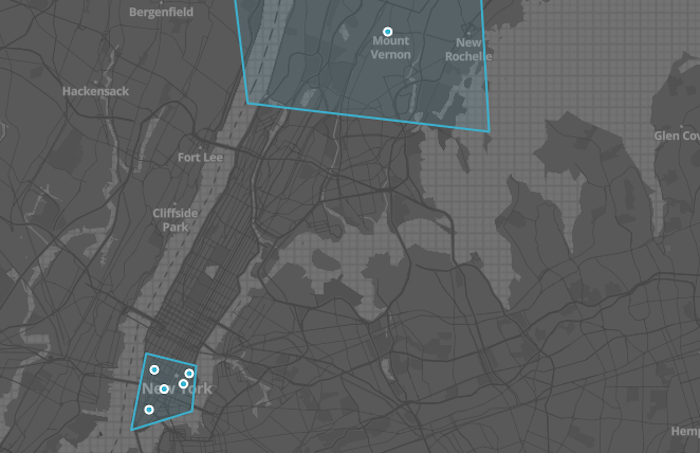

In turning to the North Atlantic region, I noticed that my region, after drawing the perimeter around the points on the map is FAR larger than that in the game. I also believe that's a result of the places being much farther apart in reality than they are rendered in the game.

The game's North Atlantic:

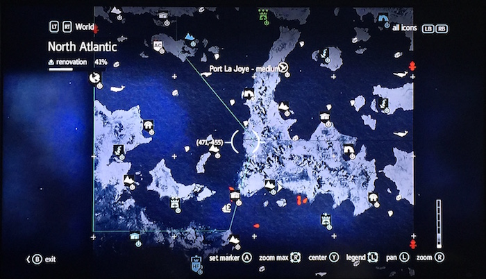

My North Atlantic:

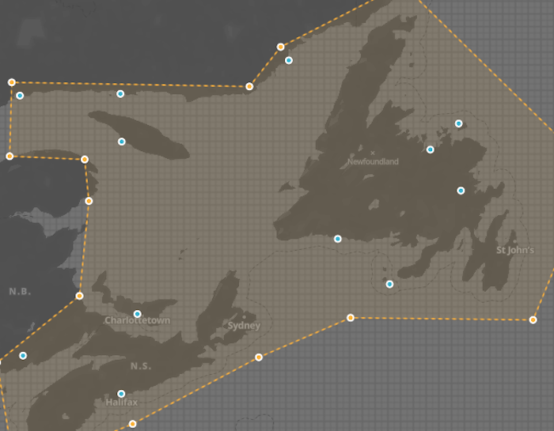

When I select the area I have designated as the North Atlantic, Mapbox tells me that the areas covers 656,834 square kilometers, which is 408,137 square miles. That's a HUGE amount of land to represent.   
As far as design is concerned, we can see that the shape of the land masses are fairly different in some places, and also—-as was the case with the River Valley--a lot of place names are made up and were unable to be mapped. I could have just picked random places, but I didn't want to do that. Overall, though, I think that the North Atlantic is a great representation.

Finally, New York is really cool because many of the places in the game are named as they still are, like Greenwich and the East Village. Here's an example of how Stuyvesant Farm looks today:

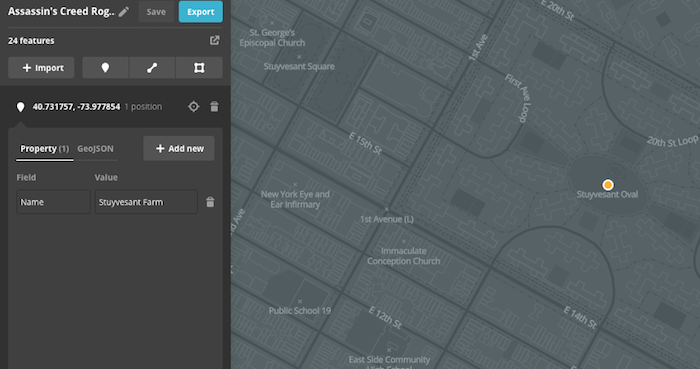  
Pretty neat how the name matches up, eh?

**Conclusion**  
The next time I make a map, I hope to have a data set of some sort in order to use a program like QGIS, one that is less visually oriented and more number oriented. For looking at a video game, however, I think my method of taking the visual and comparing it to the visual was pretty effective. Maybe some day I'll get to talk to the team at Ubisoft and see how *they* did it!
