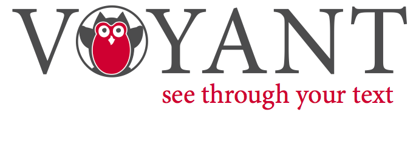
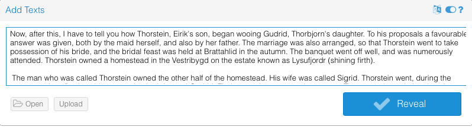
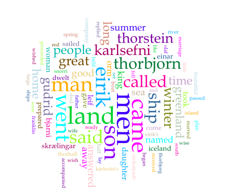
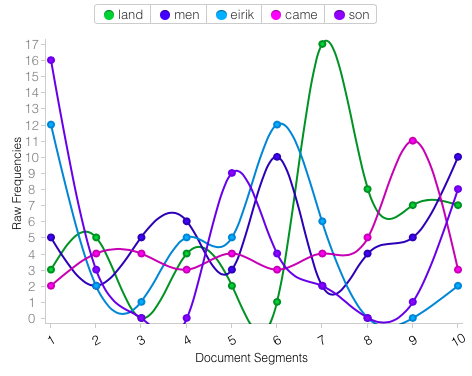

### Mining for Literary Gold
#### 9 March 2017

My first exposure to text mining was in my first year as a graduate student in the English department at the University of Texas at Austin. We were in our pro-seminar, methodologies course and talking about Franco Moretti, whom I had heard of before, but didn’t know too much about other than the usual complaint about his obsession with big data. We were talking about his work in conjunction with the voluminous tomes of Victorian England and how text mining was a really “useful” tool when trying to analyze change in language use over time. This reminded me of the moment in Ted Underwood’s post “Seven ways humanists are using computers to understand text,” when he says that text mining for certain words in order to read in the affective romanticism set forth in Wordworth’s poetry can be, well, fraught. It seems unlikely, or at least dubious, that measuring the occurrence of one or several words in a text can really tell us all that much about the work itself, other than the author’s proclivity for using that word. I will admit that while I will search through a stanza or a paragraph for repeated words, it seems to be a whole different beast.

Perhaps it’s because I’m a medievalist that I’m somewhat skeptical of text mining. It could be that because I work with dual-facing translations of medieval works (ranging from Latin, French, and English, and sometimes all three), or it could be that edition I work from can be from one manuscript or from several, that I resist the idea of using words’ occurrences as a basis for investigating a text. That being said, I can absolutely see the utility of text mining, or at least the interest it garners, for works of literatures after the advent of printing. I apologize for periodizing, but I think that there’s something to be said about printed texts (not that there was anything close to uniform orthography after the printing press).

Just because I think text mining is less appropriate for medieval texts, it would be really interesting to use the mining, much like the project creators for “Mining the *Dispatch*,” in order to see a trend over time and geographic space. One particular way I’m thinking about this, for medieval texts, is by taking into consideration Paul Zumthor’s *mouvance*. If there were a way to compile all of the ms. editions for one particular text, and create a data set for provenance, orthographic variation, date of creation, and material, we could potentially trace the factors involved—other than scribal error—in textual variance.

One way to achieve my project is absolutely through the use of OCR. Unfortunately for me, OCR correctors or normalizers don’t really exist for medieval script. The reasons behind this are various and sundry, but it is likely, once again, that the dividing factor here is once again is printing. It would be difficult to normalize texts when many hands are involved in the creation and editing of any one manuscript, and each manuscript can contain a bunch of linguistic variations and oddities; not to mention, again, that they mss. I work on are not written in English and are heavily abbreviated. So, while I get really excited to hear about “semi-decent” normalizers or correctors for 18th-century texts, or even early modern printed texts, it’s frustrating that one of the biggest problems an 18th-century work in OCR is the long S. (Also, I can imagine my friend and colleague Paula Curtis agreeing with me, and probably feeling more adamantly, about the lack of OCR programs available for non-English medieval texts, especially since she works with medieval Japanese sources.
So, to wrap up, I think that text mining is a really cool thing to investigate, and I believe that it can bring new understanding to texts that close reading cannot. For book historians, too, I can imagine it being a great resource. For me, I think text mining would be useful in the future when I inevitably move into the Early Modern period and start looking at different texts. Specifically, my interest in travel narrative might be an interesting starting point for investigating words and their frequency and usage. At this point, however, I’m hard pressed to see any easy, feasible, and in many ways, useful advantages to mining the texts that I work with. As is the case with anything, however, we shall see where I end up, and I am certainly open to trying new methods.

I decided to try my hand at text mining using Voyant:

First I began by choosing Donald Trumps address to Congress from several weeks ago, but I decided that I didn't want my work to condone that type of rhetoric. So, instead, I remained in line with my research and chose to see which terms were most frequently used in *Eiriks saga rauða* ("Erik the Red's Saga") which is one of the sagas I'm analyzing for a paper. I used a plain text version of the saga,which also is available in Norwegian and Old Norse, and copy & pasted the text into Voyant's tool:

After clicking "Reveal," Voyant presented me with a **lot** of results including a summary of terms and phrases, a world cloud, links between words, trends, and contexts in which frequently used words appear. Here is an example of the word cloud and the trend that Voyant provided:

The word cloud and frequency count were actually really illuminating. In my class, students were saying that when compared with *Grænlendlinga saga* which is the saga paired with *Eiriks saga rauða* in what moderns scholars categorize as the "Vinland Sagas," Eirik the Red doesn't actually appear very much in the text. This affective analysis is contradicted by the fact that "Eirik" occurs 45 times in the text and is the third most frequent word, after "land" and "men." So, if we deconstruct the text, we can see that Eirik is actually very present *textually*, even if he doesn't seem to be as present in the narrative. Perhaps this is a very useful nuance of text mining.

Also, from the word cloud it would seem that "men" are very important in the story because they appear very frequently. And while this is ostensibly true, I believe that the women in *Eiriks saga rauða* are the most interest: Gudrid and Freydis. So in this way, more "valuable" information comes from reading the text.

The trends section is useful if I were to see how frequently a word in the text appears at a certain section. According to Voyant's analysis, "land" was mentioned 17 times in the 7th section. Knowing something about the text, I would say that this is probably where the vikings come to North America and begin naming the various lands, like Markland, Helluland, and Vinland.

At some point, I would like to mine both *Eiriks saga rauða* and *Grænlendina saga* to see how they compare textually, but for now, I will that text mining seems to be a good complement to texts, and an interesting way to complicate how we read, but I don't believe it ought to be the *only* way to approach a textual analysis.
