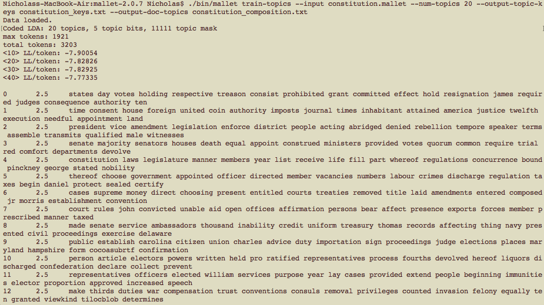

### Staying on topic
#### 16 March 2017
##### Updated 26 April 2017 

I have had a total bear of a time trying to use the command line in order to do some topic modeling. At first, and since I was working with the texts in another course of mine, I thought I would create a topic model from some translated Icelandic sagas. However, MALLET did not like that I was trying to use texts that weren't strictly English. It's likely that the names of people and places (all nouns, I guess) weren't fully translated.

So, since my first plan was thwarted, I set out to use a text that was going to be easily read by MALLET. Ideally, I would have used lots of texts--like with the sagas--in order to ensure a more comprehensive result. At this point, however, I really just wanted to get MALLET to give me some results. With that in mind, I chose the **United States Constitution**, which I was sure MALLET would be able to read. Unlike our government officials.

In order to learn what I was doing, I used the tutorial found [here](http://programminghistorian.org/lessons/topic-modeling-and-mallet). Just a quick note: If you are not as comfortable with the command line as you want to be, this tutorial is really frustrating. The instructions seem more geared toward PC users, one of which I am not. I had to change the direction of the slashes, "/," I typed onto the command line.

But I ultimately had success after an embarrassing amount of time spent on the command line. Here is the process I used after I installed MALLET and after I failed miserably with creating a model for the sagas:

**1.**  
As per the tutorial, I entered the MALLET directory and asked for the HELP menu. This menu gives you all the possible commands you can type while using MALLET:

**2.**  
The next step was to create a tutorial or test model using the sample data that was provided for me in the MALLET folder when I downloaded it. Of *course* I typed something into the command line incorrectly, as I always do. I received the dreaded error message, which informs me that "blah blah blah is not a directory," and that I have no business looking for it:

**3.**  
After fixing my mistake, I got the tutorial to works! Results! See?:

As it turns out, the numbers on the left-hand side are the paragraph numbers. 0 is paragraph 1, 1 is paragraph 2, and so on. the next number over is what is called the *Dirichlet parameter*, which determines the weight for that particular topic. I  thought it was very interesting that within the first paragraph of the tutorial results were words like "Erik" and "saga". The ghosts of my failed models were haunting me, since one of the sagas I was going to use was *Eirik the Red's Saga*. Alas.

**4.**  
In the wake of my first victory, I was feeling confident that I would be able to successfully model my own text. The Constitution was ready and awaiting its time on the runway. That was a model joke. *Anyway*, I was, of course, unsuccessful on my first try and received *dun dun dun* the error message:

**5.**  
I went back and fixed my error and I was able to get **RESULTS**! MALLET read the Constitution text I had provided and gave me a whole long list that was divided into 20 paragraph sections (as I told it to, because this was tutorial's suggestion):

An important note here, MALLET searches a folder, not just an individual file. So, I had to divide my text file into a couple differed files within the same folder. Of course, a topic is something that happens across different works. That's why, in the test model, words like "Thylacine," "president" and "saga" occur in the same paragraph--it's not the same paragraph in the same text!

Here are some more results:

**Conclusion**  
All that's left is to analyze my results and come to some sort of conclusion. Of course, that's hard to do with such a small corpus. Perhaps I'd be able to yield more interesting results if I created a model of different English language Constitutions, like that of Canada, the US, India, the UK, etc. But for now, I can say definitively that I cannot foresee myself using topic modeling as a tool in the near future. But, one never knows!
