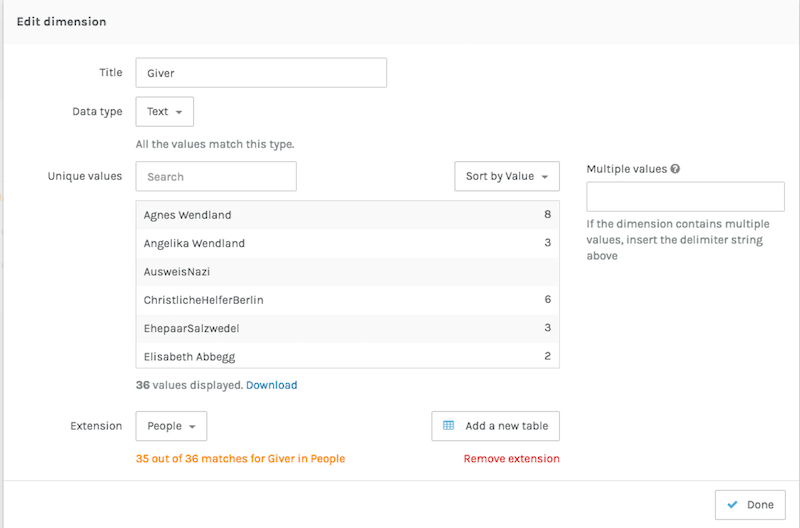

### Network, Network, Network!
#### 23 March 2017
##### Updated 27 April 2017

First things first. I downloaded Gephi onto my computer and started to follow the tutorial, which, as I could clearly tell by the photos, was a different version from what I was using. Whatever the problem may have been, I ran into some serious user experience AND interface issues, where the panels inside the window were overlapping and making sure that I couldn't access the tools I needed in order to make my network visualization:

No thank you. So, with that being said, I decided to head immediately to [Palladio](http://hdlab.stanford.edu/palladio/) and follow that path. The *biggest* problem I had with this section—-and I have to say that I was really excited to do network visualization--is that I had and have absolutely no data sets. So, in lieu of an application of the network visualization process to my own work (of which there is none), I'm going to walk you through my process using Palladio via the [Programming Historian tutorial](http://programminghistorian.org/lessons/creating-network-diagrams-from-historical-sources).

Welcome to Palladio:

I have to say, from the beginning, I was *far* more impressed with Palladio than I was with Gephi. From the get-go. It could be because it's run by Stanford and they have some of the best work in DH right now. But, I'm not biased, merely stating the facts.

The first step, as it was with the mapping process back when I used [Mapbox](blogpost4.5.html), is to input a data set so the program has some numbers to work with. As is increasingly the case, I have to get more and more used to number. Such is the life of a digital humanist! I got my sample data set from the Programming Historian tutorial, which was really nice. Palladio, similarly, has sample data you can use, should you wish to do so:

After I downloaded the CSV file, I dragged it into the text box provided by Palladio, and it rendered itself:

After the data was loaded, I was taken to the main dashboard, where I could manipulate the input and indicate all the specifications I wanted for the network. This is what the first panel that I was taken to looks like:

In order to actually create a network, I needed more than the "attributes" that I had uploaded before. Indeed, I had to input exactly what is found at the network's core: "relations." So, I clicked on "Person" in my primary table and then under extension, I added a new table and uploaded more data that was provided in the same spreadsheet by the Programming Historian:

After my new data set was uploaded, my options were expanding and it was starting to look like I was actually going to be able to create a network visualization. I had two panels now, and I could see how all the data was being turned into categories for the network:

I realized I needed to rename the two panels so that I could make cogent connections:

In order to make the program recognize connections, I had to go to my second panel, "Relations" and select "Giver." I was brought to a new overlay panel, and I clicked on "extension" and from the drop-down menu, I selected "people." This would tell the program that I wanted to make an edge on the network between people who had, as it turns out, first and last names. Just a note here that "Giver" was the name chosen by the Programming Historian, and indicates someone who gave help to a "recipient":

I went ahead and did the same thing for "Recipient" so that the connections can be directed between giver and recipient:

Now, going back to my main dashboard, my panels are looking fuller and ready to go:

Now that my data was all filled out, I headed over to the "graph" section of the dashboard. The other options were "map", "table", and "gallery". "Map" would be an interesting place to go if I also had geographic coordinates to go with my data sat. In the future, maybe I could build on the map data I used for my *Assassin's Creed* map and great a network visualization between the characters of the game over time. Unfortunately, I didn't have the time to go through the whole game again and create that data. Hopefully at some point I will. Here's what the "graph" section of the dashboard looked like before I touched it:

I went to the "Settings" panel on the right-hand side of the dashboard and clicked on "Source." From the new overlay menu that appeared, I picked my source dimension. That is, where will my directional edges start from? Well, they'll start from from "Giver," naturally:

I then had to choose the target dimension, which decides where I want the edges of the network to go to. In this case, it made sense to choose "recipient":

Once I set up my source and target dimensions, I had--drumroll, please--a NETWORK!:

How excited I was! The next step was to highlight the source nodes on the network. Essentially, that makes it more visually apparent which names on the network are "givers" and not just "recipients." This makes it a lot easier to interpret the information, because often times networks are pretty to look at, but without they proper clarification, they can also be pretty meaningless:

The next and final aspect to change of my network visualization is the facet dimension. Say I only want to see the "form of help" provided to various people in my network, and I also only want to see that type of help at a specific time in my data. Thus, these are the only "facets" of my data that I want represented on my visualization:

Then, out of my data, I'm able to choose from a selection:

I chose "3" for the form of help and "12" for the time, and this was the result:

Thus, to interpret this information, Rita Neumann and Ralph Neumann are the highlighted givers in this visualization, and all the other names (nodes) are recipients of the form of help I specified and the time I input. Thus, we are in complete control, using numbers, of what information we want to appear in our networks. I have to admit that this was a bit more challenging than I was initially anticipating. It could be because I was simultaneously learning a new digital tool and getting used to a new interface, but it wasn't as intuitive as I thought it would be. What I did learn, however, is the type of data I can gather from my own sources in the future in order to use Palladio for my own research, which is really exciting. It may have felt foreign to me because I was using data put together by the Programming Historian, so I didn't know precisely what was being put on the network and how it was rendering in the visualization. But, as they say, "the more you know!" Next time, I'll create my own data and my own network!
